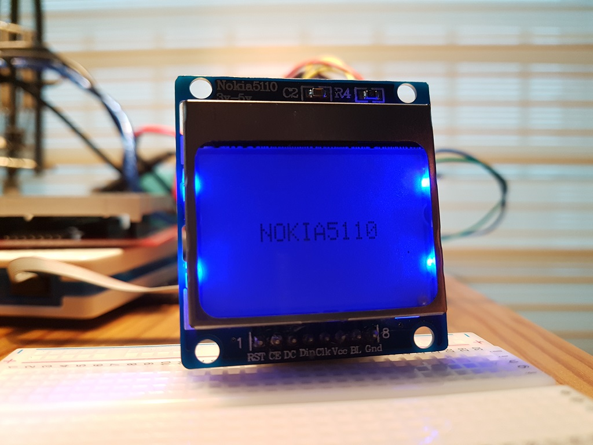
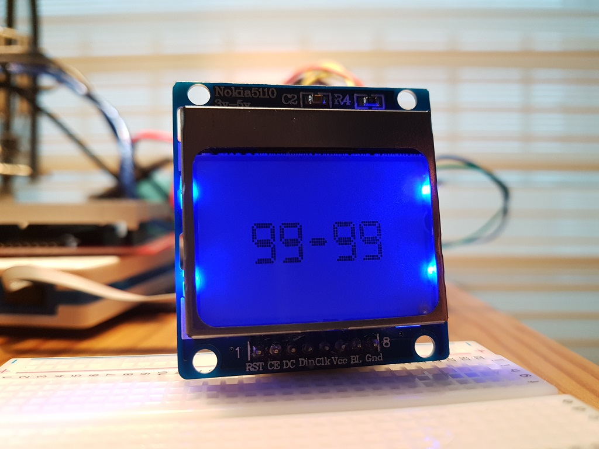
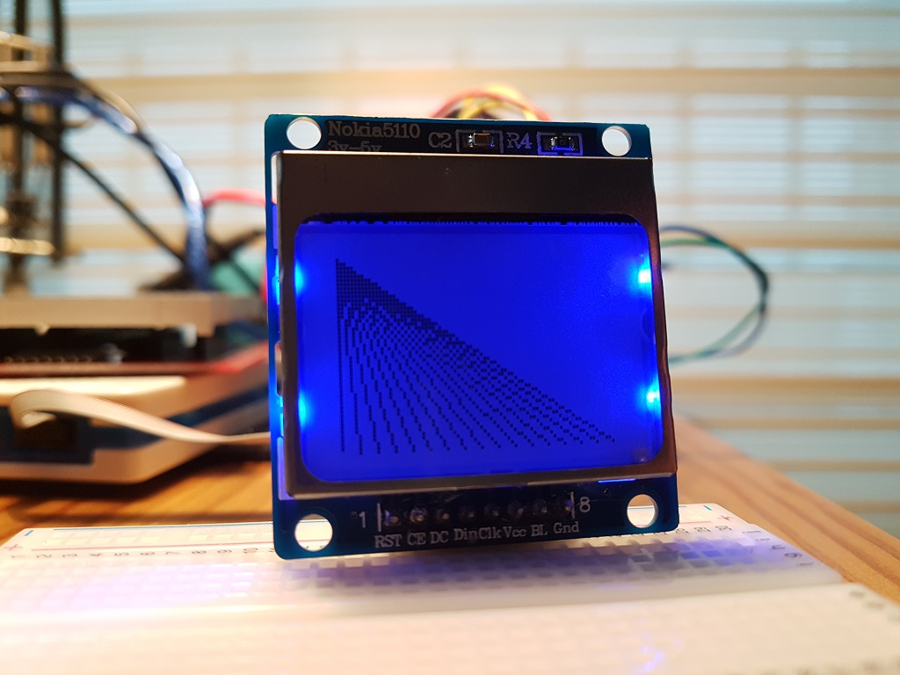
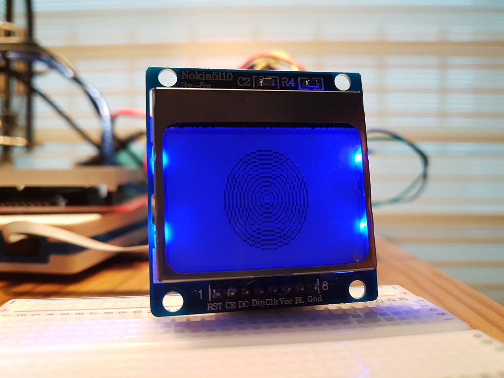
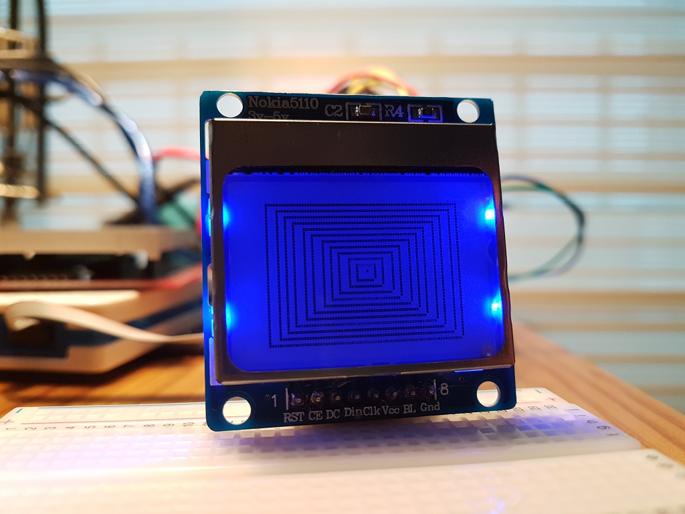
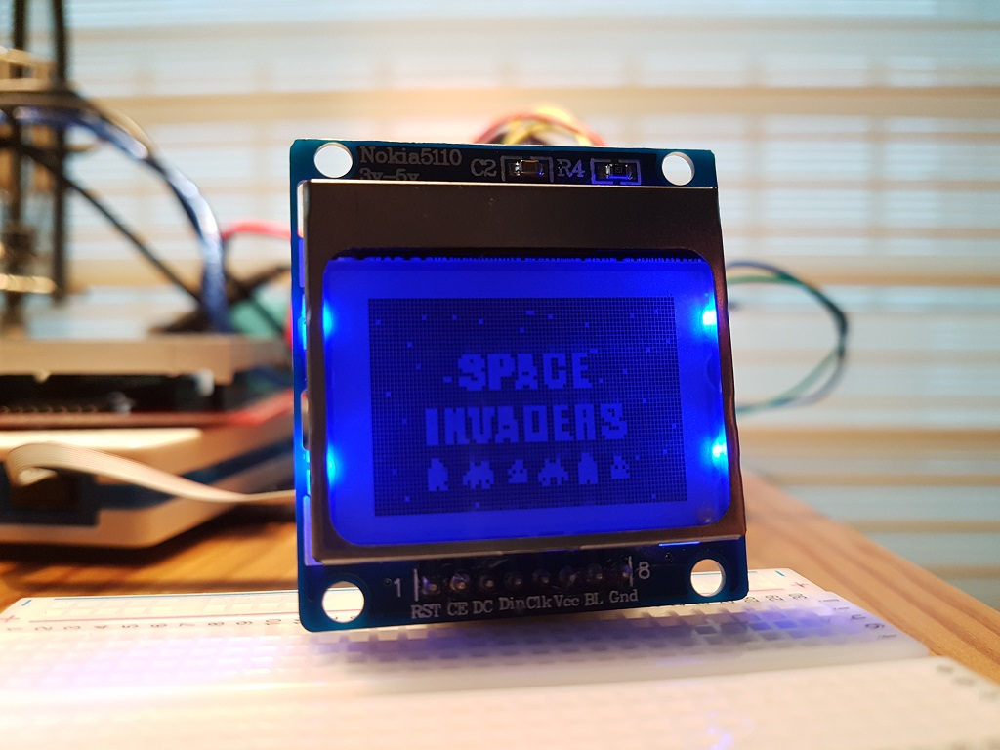

# AVR_NOKIA5110
NOKIA5110 Library for AVR + Example code

ATmega328p MCU was used for testing. 
You may need to modify SPI features to use this libary for other AVR MCUs.

I've downloaded LCD5110_Graph library for arduino and modified codes to make it run on Atmel Studio 7. 
Some of functions are modified at my convenience. 
1) Combine draw & clear functions 
2) Add fill options 
3) Changed draw circle function 
4) AVR compatible code 

Reference
Original libiray : http://www.rinkydinkelectronics.com/library.php?id=47 
Bitmap source : http://educ8s.tv/arduino-oled-display-graphics-tutorial/

 
 
 
 
 
 
 
